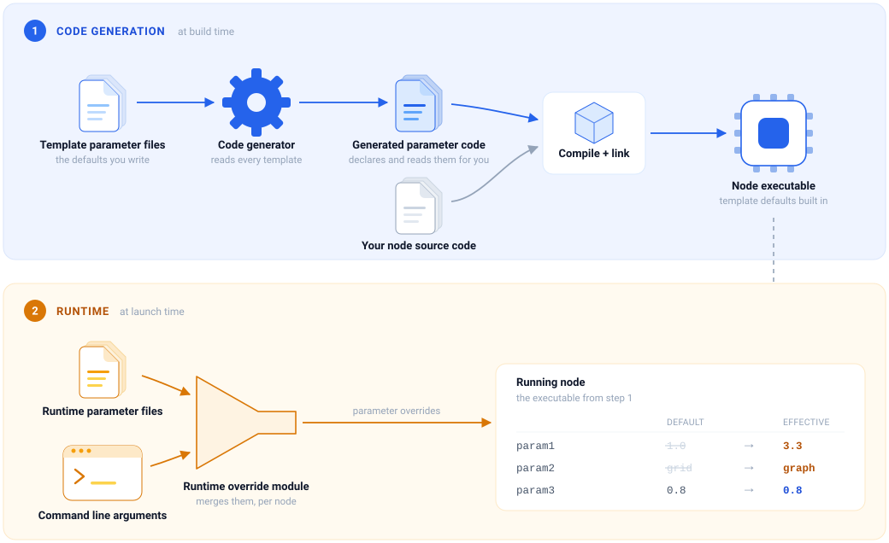
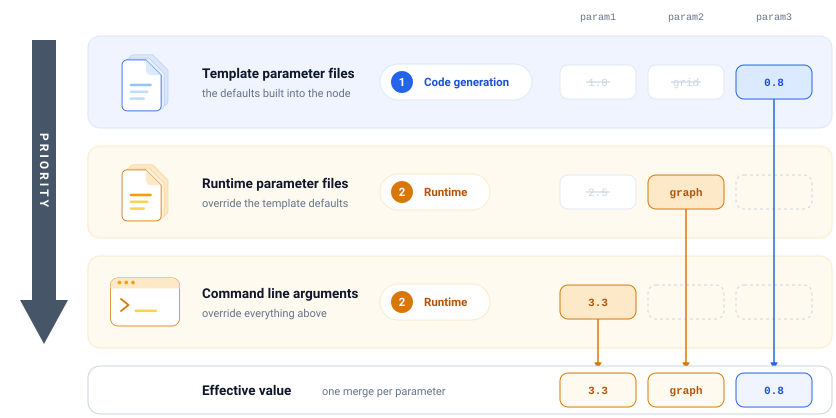

Parameter Library
=================

.. note::

    **Acknowledgement:** The code-generation portion of this library was modified from the
    existing `generate_parameter_library <https://github.com/pickNikRobotics/generate_parameter_library>`_ ROS2 package.
    For more details, refer to the :ref:`Comparison to generate_parameter_library <comparison-to-generate-parameter-library>`.

The ``avt_341_param_lib`` library package is used to help manage large sets of ROS parameters.
Parameters are managed in a hierarchical format allowing selective parameter overrides at each stage.
It consists of two major processing steps:

#. **Code-Generation:** Invoked at build time. Converts input template yaml files into C++ or python
   code which is built into referencing the node executable.
   The generated code automatically manages declaring and loading ROS parameters corresponding to the template yaml.

#. **Runtime:** Invoked when nodes are ran through ROS launch. Intercepts and manipulates input runtime parameter files
   and command line arguments. Provides final merged parameter values to node.

The manipulation of parameters through these stages is summarized in :numref:`fig-param-lib-overview`.

    Overview of parameter manipulation pipeline.

:numref:`fig-param-lib-priority` further illustrates the priority of the different parameter sources, with command line arguments having highest priority.
Note that parameter overriding is done on a per-parameter basis. Parameters which are not specified in higher priority sources will retain their lower priority values.

    Hierarchical parameter override priority.

.. note::

    Template file parameters apply to **node classes** while runtime parameters may apply further
    to named **node instances** (such as specified in a launch file) only known at run-time.

Code-Generation Configuration
-------------------------------------------

This sections describes the major configuration elements in the code-generation step. These are:

#. :ref:`Template parameter files <template-parameter-files>`
#. :ref:`CMake and in-code usage <cmake-and-in-code-usage>`

.. _template-parameter-files:

Template Parameter Files
^^^^^^^^^^^^^^^^^^^^^^^^^^^

Template parameter files define the set of all available ROS parameters including their names, default values and type.
Refer to the ``avt_341_param_lib_example/parameters`` sample ROS2 package for an example.

:numref:`lst-param-template-basic` shows a basic template parameter file.

.. code-block:: yaml
    :name: lst-param-template-basic
    :caption: Basic template parameter file.

    code_namespace: nav_demo
    ros__parameters:
      cruise_speed:
        type: double
        default_value: 1.0
        description: "Cruising speed of the vehicle in m/s"
      planner_mode:
        type: string
        default_value: "grid"
        description: "Planning algorithm selection"
        validation:
          one_of<>: [ [ "grid", "graph" ] ]

.. _template-root-keys:

**Root YAML Keys**

The keys accepted at the root of a template parameter file are listed in :numref:`tbl-param-root-keys`.
Any other root key will result in a code-generation error.

.. list-table:: Template parameter file root yaml keys.
    :name: tbl-param-root-keys
    :header-rows: 1
    :widths: 22 53 25

    * - Key
      - Description
      - Default value
    * - ``class_name``
      - C++ or Python class name of the generated parameter structure.
      - ``Params``
    * - ``code_namespace``
      - C++ namespace for the generated code. Slash-separated tokens become nested namespaces.
      - *Required*
    * - ``ros__parameters``
      - Non-empty mapping holding the parameter definitions.
      - *Required*

.. _template-mixins:

**Mixins**

A mixin is a reusable fragment of parameter definitions which can be included in other template files.
Use the ``__include_mixins: <mixin-list>`` syntax in any level of the  ``ros__parameters`` tree to include mixins.
Each mixin's parameters are spliced into the mapping holding the ``__include_mixins`` key.

:numref:`lst-param-mixin-file` defines a mixin, which is then included by the template file in
:numref:`lst-param-template-mixin`.

.. code-block:: yaml
    :name: lst-param-mixin-file
    :caption: Mixin file ``mixins/geometry_mixin.yaml``.

    code_namespace: params/core
    ros__parameters:
      geometry:
        width:
          type: double
          default_value: 200.0
          description: "Total grid width in meters."

.. code-block:: yaml
    :name: lst-param-template-mixin
    :caption: Template parameter file including the mixin.

    code_namespace: params/costmap
    ros__parameters:
      costmap:

        __include_mixins: geometry_mixin

        thresh:
          type: double
          default_value: 0.5
          description: "Minimum cell slope that is considered occupied."

.. note::

    Mixin parameters are addressed by their position in the including tree, giving a final parameter
    path of ``<parent_tree>.<mixin param>``. In the example above the mixin defines ``geometry.width``,
    which is included under ``costmap`` and is therefore addressed as ``costmap.geometry.width``.

.. _cmake-and-in-code-usage:

CMake and In-Code Usage
^^^^^^^^^^^^^^^^^^^^^^^^^^^^^^^^

Code generation is invoked from the package ``CMakeLists.txt`` as shown in :numref:`lst-param-cmake`.
``avt_341_generate_cpp_parameters()`` takes a folder (or glob) of template files and generates a data
transfer object (dto) library and a parameter service library per template, both named after the
template file stem. Node targets then link the service library.

.. code-block:: cmake
    :name: lst-param-cmake
    :caption: Invoking code generation from ``CMakeLists.txt``.

    find_package(avt_341_param_lib REQUIRED)

    # parameters/costmap.yaml -> costmap_params_dto and costmap_params_service
    avt_341_generate_cpp_parameters(parameters)

    add_executable(costmap_node src/costmap_node.cpp)
    target_link_libraries(costmap_node PUBLIC costmap_params_service)

The python equivalent is ``avt_341_generate_python_parameters()``.

The generated service header is included as ``<package_name>/<stem>_params_service.hpp`` and declares a
``<class_name>Listener`` class in the template's ``code_namespace``. Constructing the listener declares
and loads all parameters, and ``get_params()`` returns the populated parameter structure.
:numref:`lst-param-node` reads the parameters of the template file shown in
:numref:`lst-param-template-mixin`.

.. code-block:: cpp
    :name: lst-param-node
    :caption: Reading parameter values in a C++ ROS node.

    #include <rclcpp/rclcpp.hpp>

    #include <my_package/costmap_params_service.hpp>

    class CostmapNode : public rclcpp::Node {
     public:
      CostmapNode() : Node("costmap") {
        param_listener_ = std::make_shared<params::costmap::ParamsListener>(
            get_node_parameters_interface(), get_logger());
        params_ = param_listener_->get_params();

        RCLCPP_INFO(get_logger(), "grid width: %f", params_.costmap.geometry.width);
      }

     private:
      std::shared_ptr<params::costmap::ParamsListener> param_listener_;
      params::costmap::Params params_;
    };

Runtime Configuration
-------------------------------------------

Runtime parameter configuration can be used to override the template defaults provided during code generation.
The major configuration elements in the runtime step are:

#. :ref:`Runtime parameter files <runtime-parameter-files>`
#. :ref:`Node configuration file <node-configuration-file>`
#. :ref:`Command line arguments <command-line-arguments>`
#. :ref:`Parameter expressions <parameter-expressions>`

.. _runtime-parameter-files:

Runtime Parameter Files
^^^^^^^^^^^^^^^^^^^^^^^^^^^

Runtime parameter files are an existing concept in ROS2 parameter but this library includes several augmentations.
Nonetheless, the basic parameter file format and node selector syntax is briefly reviewed in this section.

Each top-level node in a runtime parameter file consists of a node selector with possible wildcards ``*`` or ``**``
followed by the ``ros__parameters`` key-value map.
Unlike, template parameter files, which are linked to node targets in the ``CMakeLists.txt``, runtime parameters apply
to named node instances to support possibly having several instances of the same node class.

:numref:`lst-param-runtime-file` overrides two of the parameters declared by the template file in :numref:`lst-param-template-mixin`.

.. code-block:: yaml
    :name: lst-param-runtime-file
    :caption: Runtime parameter file overriding template defaults.

    /**:
      ros__parameters:
        costmap:
          geometry:
            width: 400.0

    /**/costmap_node:
      ros__parameters:
        costmap:
          thresh: 0.75

**Selector Syntax**

Node selectors use the standard ROS2 parameter file convention: a slash-delimited path of namespace
tokens ending in a node name, where ``**`` matches any number of tokens, ``*`` matches exactly one
token, and any other token matches literally. The possible forms are given in
:numref:`tbl-param-selectors`.

.. list-table:: Node selector forms and the nodes they match.
    :name: tbl-param-selectors
    :header-rows: 1
    :widths: 26 37 37

    * - Selector
      - Matches
      - Does not match
    * - ``/**``
      - Every node, in any namespace and at any depth.
      - --
    * - ``/**/costmap_node``
      - ``/costmap_node``, ``/veh1/costmap_node``, ``/veh1/nav/costmap_node``
      - ``/veh1/planner_node``
    * - ``/*/costmap_node``
      - ``/veh1/costmap_node``, ``/veh2/costmap_node``
      - ``/costmap_node``, ``/veh1/nav/costmap_node``
    * - ``/veh1/**``
      - Every node under ``/veh1``, at any depth.
      - ``/veh2/costmap_node``
    * - ``/veh1/costmap_node``
      - Only ``/veh1/costmap_node``.
      - ``/veh2/costmap_node``, ``/veh1/nav/costmap_node``

Entries which a matched node does not declare stay dormant. Sections are applied in document order and
then file order, with later entries winning. ROS2 has no specificity based precedence, so broader
sections must be placed before more specific ones.

.. _node-configuration-file:

Node Configuration File
^^^^^^^^^^^^^^^^^^^^^^^^^^^

The node configuration file includes additional settings per node.
Currently topic remappings (``remappings`` key) and environment variables (``additional_env`` key) are supported.
This is a novel configuration file type, not native to the ROS2 ecosystem.
It uses the same selector syntax as runtime parameter files (:numref:`tbl-param-selectors`).
:numref:`lst-param-node-config` shows an example file.

.. code-block:: yaml
    :name: lst-param-node-config
    :caption: Node configuration file.

    /**/perception_local_node:
      remappings:
        avt_341/terrain_slope: avt_341/terrain_slope_local

    /**/uab_perception_node:
      remappings:
        avt_341/points: /ouster/points
      additional_env:
        LOG_LEVEL: debug

.. _command-line-arguments:

Command Line Arguments
^^^^^^^^^^^^^^^^^^^^^^^^^^^

Command line arguments have the highest priority and override the values of any runtime parameter file,
again per parameter. Where several command line entries apply to the same parameter, the last one wins.

ROS2 does not natively support the node selector syntax as is used in parameter files (:ref:`described earlier <runtime-parameter-files>`).
This library adds that capability: launch arguments which look like a selector
are intercepted before the nodes are launched and expanded using the same rules as parameter files.

.. _cli-selector-syntax:

**Selector Syntax and Automatic Expansions**

Command line selectors may be abbreviated. The library completes them against the list of vehicle ids
being launched, as summarized in :numref:`tbl-param-cli-expansions`. A first segment naming a vehicle
scopes the override to that vehicle; any other first segment applies across all vehicles.

.. list-table:: Command line selector expansions, for vehicle ids ``veh1`` and ``veh2``.
    :name: tbl-param-cli-expansions
    :header-rows: 1
    :widths: 36 28 36

    * - Command line argument
      - Expanded selector
      - Applies to
    * - ``width:=400.0``
      - ``/**``
      - Every node declaring ``width``. Only recognized for a parameter name declared by a template.
    * - ``**/width:=400.0``
      - ``/**``
      - Every node declaring ``width``.
    * - ``costmap_node/width:=400.0``
      - ``/*/costmap_node``
      - ``costmap_node`` of every vehicle.
    * - ``nav/costmap_node/width:=400.0``
      - ``/*/nav/costmap_node``
      - Nested ``nav/costmap_node`` of every vehicle.
    * - ``veh1/costmap_node/width:=400.0``
      - ``/veh1/costmap_node``
      - ``costmap_node`` of ``veh1`` only.
    * - ``veh1:="{width: 400.0}"``
      - ``/veh1/**``
      - Every node of ``veh1``.
    * - ``/veh1/costmap_node/width:=400.0``
      - ``/veh1/costmap_node``
      - No expansion; vehicle, namespace, node and parameter are all given.

.. _parameter-sub-maps:

**Parameter Sub-Maps**

This library also augments command line arguments with the ability to specify sub-maps to reduce repetition of stem elements. For example:

.. code-block:: bash

    ros2 launch avt_341_bringup krc.launch.py \
        veh1/costmap_node:="{costmap: {geometry: {width: 400.0}, thresh: 0.75}}"

is equivalent to the two scalar entries below.

.. code-block:: bash

    ros2 launch avt_341_bringup krc.launch.py \
        veh1/costmap_node/costmap.geometry.width:=400.0 \
        veh1/costmap_node/costmap.thresh:=0.75

.. _parameter-expressions:

Parameter Expressions
^^^^^^^^^^^^^^^^^^^^^^^^^^^

Parameter values may hold expressions which are resolved before the values are handed to the nodes.
The available expressions are given in :numref:`tbl-param-expressions`.

.. list-table:: Parameter expressions.
    :name: tbl-param-expressions
    :header-rows: 1
    :widths: 26 44 30

    * - Expression
      - Description
      - Example
    * - ``$ref{<selector>/<param>}``
      - Resolved value of another parameter in the same set of files. Must be the entire value. Where
        wildcards match several entries, the first match wins.
      - ``$ref{/**/max_speed}``
    * - ``$python{<expression>}``
      - Result of evaluating the python expression, with ``os``, ``math`` and
        ``get_package_share_directory`` available. Must be the entire value.
      - ``$python{2.0 * 3.0}``
    * - ``$pkg_path{<package>}``
      - Share directory of the package. May appear anywhere, and several times, within a string value.
      - ``$pkg_path{avt_341_bringup}/env_data``

``$ref{}`` and ``$python{}`` are resolved in runtime parameter files. ``$pkg_path{}`` is additionally
expanded in string valued command line overrides. Template parameter files are never scanned for
expressions.

.. _comparison-to-generate-parameter-library:

Comparison to generate_parameter_library
-------------------------------------------

The existing `generate_parameter_library <https://github.com/pickNikRobotics/generate_parameter_library>`_ only implements the baseline
code-generation step. **It does not contain any of the runtime parameter management features.**
This library also implements additional features in the code-generation step. The major augmentations are summarized below, by section.

**Code-Generation:**

* Additional configuration provided by :ref:`root yaml keys <template-root-keys>`.
* Support for :ref:`mixins <template-mixins>`.
* Added float32 parameter type support.
* Separated data transfer object (dto) and parameter listener service classes into separate files to reduce dependencies in referencing code.

**Run-Time:**

* Hierarchical override system merging :ref:`1) code-gen template parameter files <template-parameter-files>`,
  :ref:`2) runtime parameter files <runtime-parameter-files>`, and :ref:`3) command line arguments <command-line-arguments>`. Listed in increasing priority.
* Added concept of :ref:`node configuration file <node-configuration-file>` for topic remappings and environment variables.
* Command line support for :ref:`node selector syntax <cli-selector-syntax>`.
* Command line support for :ref:`sub-map parameters <parameter-sub-maps>`.
* :ref:`Parameter expressions <parameter-expressions>`.