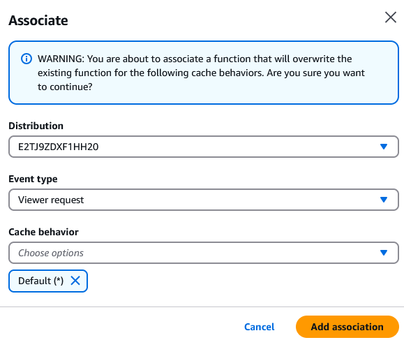
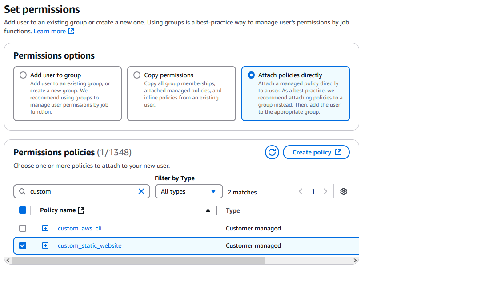
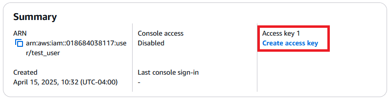
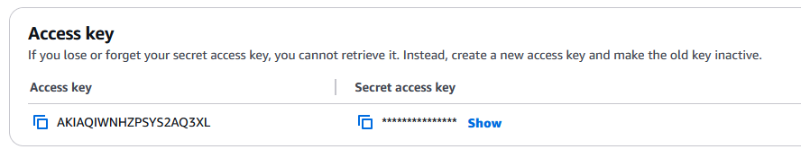
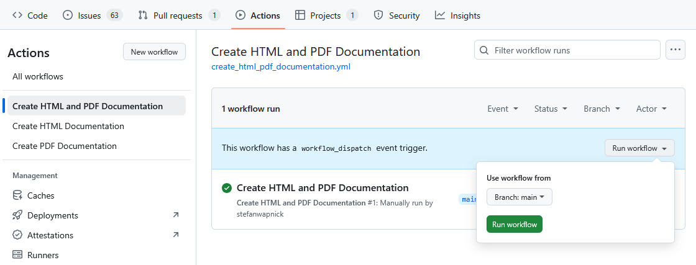

AWS Publication
===================================

This page describes how to automatically build and publish the documentation to `AWS (Amazon Web Services) <https://aws.amazon.com>`_ using
`Github Actions <https://github.com/features/actions>`_. The workflow triggers whenever changes are made to the contents of the ``docs`` folder in the ``main`` branch.

.. note::

    The setup procedure outlined below has already been completed and need only be done once.
    Nonetheless, instructions are included in case the setup needs to be replicated again.

S3 Bucket Setup
---------------------------
**Motivation:** The S3 bucket is used to store documentation contents.

After logging into the `AWS management console <https://aws.amazon.com/console/>`_, create a new `S3 bucket <https://aws.amazon.com/s3/>`_  by navigating to: ``S3 > General purpose buckets > Create bucket``.
Use the following non-default settings:

- **Object Ownership:** ACLs enabled
- **Block Public Access settings for this bucket:** Uncheck the first two options for ACLs

Once the bucket is created, navigate to ``S3 > Buckets > <select bucket> > Permissions > Bucket policy`` and paste the following contents:

.. note::

    Be sure to replace ``<S3_ARN>`` with the resource identifier of the S3 bucket which can be found under the ``Properties`` tab of the selected bucket. The ``<Cloudfront_ARN>`` will be obtained from the next section.

.. code-block:: shell

    {
        "Version": "2012-10-17",
        "Statement": [
            {
                "Sid": "AllowCloudFrontServicePrincipalReadOnly",
                "Effect": "Allow",
                "Principal": {
                    "Service": "cloudfront.amazonaws.com"
                },
                "Action": "s3:GetObject",
                "Resource": "<S3_ARN>/*",
                "Condition": {
                    "StringEquals": {
                        "AWS:SourceArn": "<Cloudfront_ARN>"
                    }
                }
            }
        ]
    }

Cloudfront CDN Setup
---------------------------

**Motivation:** Cloudfront CDN (Content Delivery Network) is used to provide data caching, authentication, and endpoint routing.

Create a new `Cloudfront distribution <https://aws.amazon.com/cloudfront/>`_ in the AWS management console by navigating to ``Cloudfront > Distributions > Create distribution``. Set the following non-default settings:

- **Origin domain:** Select the S3 bucket created in the previous step.
- **Origin access:** Origin access control settings > Create new OAC
- **Viewer protocol policy:** Redirect HTTP to HTTPS
- **Default root object:** index.html
- **Price class:** Use only North America and Europe
- **Security - Web Application Firewall (WAF):** May be disabled to reduce cost and in the case of non-security critical applications.

.. note::
    Remember to go back to the S3 bucket permission policy previously created, and update the ``<Cloudfront_ARN>`` value with
    the value of the newly created Cloudfront distribution. The ARN can be found in the ``General`` tab of the distribution.

Next, create a new Cloudfront function by navigating to ``Cloudfront > Functions > Create function``.
This function will be used to provide basic authentication. In the new function, paste the following contents:

.. code-block:: javascript

    function handler(event) {
        var crypto = require('crypto');
        var headers = event.request.headers;
        var authString = "<authstring>";
        if (
            typeof headers.authorization === "undefined" ||
            crypto.createHash(
              'sha256'
              ).update(headers.authorization.value).digest('hex') !== authString
        ) {
            return {
                statusCode: 401,
                statusDescription: "Unauthorized",
                headers: {
                    "www-authenticate": { value: "Basic" },
                    "x-source-ip": { value: event.viewer.ip},
                }
            };
        }
        return event.request;
    }

In the above function, replace ``<authstring>`` with an encoded ``<user>:<password>`` string obtained from the following python script:

.. code-block:: python

    import hashlib, base64
    hashlib.sha256(("Basic " + base64.b64encode('<user>:<password>'.encode()).decode()).encode()).hexdigest()

After the function is created, navigate to ``CloudFront > Functions > <select function> > Publish Function`` and add an associated distribution.
Select the Cloudfront distribution created previously. Below is a sample selection:

IAM User Setup
---------------------------

**Motivation:** We create a devoted API user with limited permissions to only access the S3 bucket created in the previous step. This user is invoked in the Github action.

Under ``IAM > Policies > Create policy`` create a new custom access policy with the json contents below.

.. note::

    Be sure to replace ``<S3_ARN>`` and ``<Cloudfront_ARN>`` with the resource identifier of the S3 bucket and Cloudfront distribution respectively.

.. code-block::

    {
        "Version": "2012-10-17",
        "Statement": [
            {
                "Sid": "VisualEditor0",
                "Effect": "Allow",
                "Action": [
                    "cloudfront:CreateInvalidation"
                ],
                "Resource": [
                    "<Cloudfront_ARN>"
                ]
            },
            {
                "Sid": "Stmt1744571705284",
                "Action": "s3:*",
                "Effect": "Allow",
                "Resource": "<S3_ARN>/*"
            },
            {
                "Sid": "VisualEditor1",
                "Effect": "Allow",
                "Action": [
                    "s3:ListTagsForResource",
                    "s3:ListBucketMultipartUploads",
                    "s3:ListAccessGrants",
                    "s3:ListCallerAccessGrants",
                    "s3:ListBucketVersions",
                    "s3:ListBucket",
                    "s3:ListAccessGrantsLocations",
                    "s3:ListMultipartUploadParts"
                ],
                "Resource": "<S3_ARN>"
            }
        ]
    }

Next, create a new user from ``IAM > Users > Create user``. During the ``Set permissions`` step of the creation wizard, select the custom policy created previously.

Under the newly created user details, create a new access key. During the creation process, make sure that ``Use case: Command Line Interface (CLI)`` is selected.

In the final page of the user creation wizard, the access key and secret key will be displayed. **Copy these keys for use in the** `Github Action Setup <#github-action-setup>`_. Below is a sample result:

Github Action Setup
---------------------------

**Motivation:** Defines a workflow that automatically triggers when changes to the documentation are detected.
The workflow pushes documentation changes from the Github repository to the AWS S3 bucket.

Action Definition
^^^^^^^^^^^^^^^^^^^^^^^^
Create a new workflow file under ``.github/workflows/<workflow_name>.yml`` with the following contents:

.. code-block::

    name: Create HTML and PDF Documentation

    on:
      push:
        branches:
          - main
        paths:
          - docs/**

      workflow_dispatch:

    permissions:
      contents: read
      pages: write
      id-token: write

    concurrency:
      group: documentation
      cancel-in-progress: false

    jobs:
      deploy:
        environment: documentation
        runs-on: ubuntu-latest
        steps:
          - name: Checkout Repository
            uses: actions/checkout@v4

          - name: Install Python 3.8
            uses: actions/setup-python@v5
            with:
              python-version: '3.8'
              cache: 'pip' # caching pip dependencies

          - name: Install Dependencies
            run: |
              sudo apt update
              sudo apt install doxygen latexmk texlive-latex-extra
              pip install -r requirements.txt

          - name: Build HTML and PDF documentation
            run: cd docs && make html && make latexpdf

          - name: Publish to AWS
            uses: aws-actions/configure-aws-credentials@v2
            with:
              aws-access-key-id: ${{ secrets.AWS_ACCESS_KEY_ID }}
              aws-secret-access-key: ${{ secrets.AWS_SECRET_ACCESS_KEY }}
              aws-region: ${{ secrets.AWS_REGION }}
          - name: Copy HTML and PDF Documentation to S3
            run: |
              aws s3 cp docs/build/html s3://${{ secrets.AWS_S3_BUCKET_NAME }} --recursive --acl public-read
              aws s3 cp docs/build/latex/nato-avt-341-stack.pdf s3://${{ secrets.AWS_S3_BUCKET_NAME }} --acl public-read
              aws cloudfront create-invalidation --distribution-id ${{ secrets.AWS_CLOUDFRONT_DISTRIBUTION_ID }} --paths "/*"

**Workflow code notes:**
    - The workflow builds both html and pdf documentation.
    - Publication to AWS requires secret keys for S3 and cloudfront endpoints and user credentials.
    - The final ``create-invalidation`` command is used to force the cloudfront CDN cache to refresh its cache to accommodate the new updates.

Action Secrets
^^^^^^^^^^^^^^^^^^^^^^^^

Under the Github repository settings, create the following secrets by navigating to: ``Github Repository > Settings > Secrets and variables > Actions > New repository secret``

================================    ===============
Secret Key                          Value
================================    ===============
AWS_REGION                          AWS region under which S3 bucket exists (e.g. us-east-1)
AWS_S3_BUCKET_NAME                  Name of S3 bucket (not ARN, just simple name)
AWS_CLOUDFRONT_DISTRIBUTION_ID      Cloudfront distribution ID found in the AWS console (not ARN, just simple ID)
AWS_ACCESS_KEY_ID                   Key id of access token created in previous step
AWS_SECRET_ACCESS_KEY               Secret key of access token created in previous step
================================    ===============

Testing
^^^^^^^^^^^^^^^^^^^^^^^^
Once the Github repository has been updated, the workflow can be manually run under ``Github Repository > Actions > Select workflow > Run workflow``.

