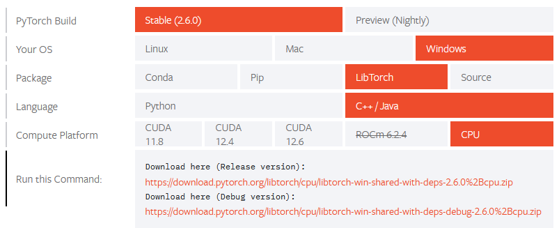

ROS 2 Windows - Build From Source
==================================

- Installation of a `ROS2 distribution <https://docs.ros.org/en/rolling/Releases.html>`_.
- Working ROS2 `colcon workspace <https://docs.ros.org/en/humble/Tutorials/Beginner-Client-Libraries/Colcon-Tutorial.html>`_

.. note::

    Ensure that ``<ros_ws>/install/local_setup.bat`` has been sourced in your workspace.
    It helps to put this command in a startup ``.bat`` script. For example:

    .. code-block:: shell

        call %userprofile%\source\ros_ws\install\local_setup.bat

Install Dependencies
----------------------

Julia (for MPC local planner)
""""""""""""""""""""""""""""""""""""""

Download and run the Julia 1.5.4 installer for Windows: `v1.5.4 exe x86_64 version <https://julialang-s3.julialang.org/bin/winnt/x64/1.5/julia-1.5.4-win64.exe>`_

Add the following environment variable:

==============  ===================
Env. Variable   Value
==============  ===================
Julia_DIR       | <julia_install_path>
                | ``ex: C:\\Users\\stefan\\AppData\\Local\\Programs\\Julia 1.5.4``
==============  ===================

Add the following to the system ``PATH`` variable:

.. code-block:: shell

    <julia_install_path>\bin    # (ex: C:\Users\stefan\AppData\Local\Programs\Julia 1.5.4\bin)
    <julia_install_path>        # (ex: C:\Users\stefan\AppData\Local\Programs\Julia 1.5.4)

Open a new terminal, enter the Julia interpreter package manager interface:

.. code-block:: shell

    PS> julia       # Enter Julia interpreter (type 'julia' in powershell interface then enter)
    julia> ]        # Enter package manager interface (type ']' then enter)
    (@v1.5) pkg> add https://github.com/JuliaMPC/NLOptControl.jl     # While in package interface, add NLPopt remote
    (@v1.5) pkg> add JuMP     # Add packages
    (@v1.5) pkg> add PackageCompiler
    (@v1.5) pkg> add RobotOS
    (@v1.5) pkg> add PyCall
    (@v1.5) pkg> <backspace>      # Hit backspace to exit package manager interface
    julia> import Pkg; Pkg.add(Pkg.PackageSpec(;name="Ipopt", version="0.7.0"))   # Install v0.7.0 of Ipopt

Correct line 269 in ``C:\Users\<username>\AppData\Local\Programs\Julia 1.5.4\include\julia\atomics.h``
``template<typename T, typename T2>`` is missing from the function ``jl_atomic_store_relaxed``

The edited version should appear as:

.. code-block:: shell

    template<typename T, typename T2>
    static inline void jl_atomic_store_relaxed(volatile T *obj, T2 val)
    {
        *obj = (T)val;
    }

PCL (Point Cloud Library)
""""""""""""""""""""""""""""""

Download the PCL v1.12.1 library `PCL-1.12.1-AllInOne-msvc2019-win64.exe <https://github.com/PointCloudLibrary/pcl/releases/download/pcl-1.12.1/PCL-1.12.1-AllInOne-msvc2019-win64.exe>`_ and run the executable.

Make sure the following environment variables are set:

==============  ===================
Env. Variable   Value
==============  ===================
PCL_ROOT        | <pcl_install_path>
                | ``ex: C:\Program Files\PCL 1.12.1``
==============  ===================

Add the following to the PATH variable:

.. code-block:: shell

    C:\Program Files\PCL 1.12.1\bin
    C:\Program Files\PCL 1.12.1\3rdParty\VTK\bin
    C:\Program Files\PCL 1.12.1\3rdParty

Pytorch C++ Library
""""""""""""""""""""""""""""""""""""""
Download the `Pytorch C++ library <https://pytorch.org/get-started/locally/>`_. CPU version is recommended for ease of use
though consider installing the CUDA version for improved runtime performance.

Unzip the archive to a folder. Make sure the following environment variables are set:

==============  ===================
Env. Variable   Value
==============  ===================
Torch_DIR       | <torch_install_path>
                | ``C:\libtorch``
==============  ===================

For the GPU accelerated version, set the ``Torch_CUDA_DIR`` environment variable instead.

ROS Package Dependencies
"""""""""""""""""""""""""""""

Download the following packages into your ``<ros_ws>/src`` folder. Make sure that the branches
are correct (note the ``-b`` modifier).

.. code-block:: shell

    cd <workspace_path>\src
    git clone https://github.com/ros-drivers/ackermann_msgs.git -b ros2
    git clone https://github.com/ros-perception/pcl_msgs.git -b ros2
    git clone https://github.com/ros-perception/perception_pcl.git -b humble
    git clone https://github.com/ros-perception/vision_opencv.git -b humble
    git clone https://github.com/ros-perception/vision_msgs.git -b ros2

In the latest version of ``pcl_ros`` there is a bug related to Windows linking with the NATO stack that
must be corrected in the ``pcl_ros`` package's ``CMakeLists.txt``. Open the file ``<ros_workspace>/src/perception_pcl/pcl_ros/CMakeLists.txt``.
Change the ``add_library`` to use a ``STATIC`` library instead of ``SHARED`` on line 122 to:

.. code-block:: shell

    add_library(pcd_to_pointcloud_lib STATIC tools/pcd_to_pointcloud.cpp)
    # Previously add_library(pcd_to_pointcloud_lib SHARED tools/pcd_to_pointcloud.cpp)

Open a Developer Prompt, source ros and build the package dependencies:

.. code-block:: shell

    cd <workspace_path>
    colcon build --merge-install --packages-select ackermann_msgs vision_msgs vision_opencv cv_bridge image_geometry pcl_conversions pcl_msgs pcl_ros perception_pcl
    call <workspace_path>\install\local_setup.bat

.. note::

    The ``--event-handlers console_cohesion+`` parameter can be used to obtain additional logs.

Build Source Code
---------------------

Download the `avt-341 stack <https://github.com/TulgaErsal/nato-avt-341-stack>`_ into your workspace and build it.

.. code-block:: shell

    cd <ros_ws>\src
    git clone https://github.com/TulgaErsal/nato-avt-341-stack.git avt_341_stack

Build the packages:

.. code-block:: shell

    cd <ros_ws>
    colcon build --merge-install --packages-select avt_341_msgs avt_341

.. note::

    The ``--event-handlers console_cohesion+`` argument can be used to obtain additional logs (for example ``colcon build --merge-install --packages-select avt_341_msgs avt_341``).

Testing
----------

To test the installation, execute the following command. Rviz should appear with a mock scenario.

.. code-block:: shell

    ros2 launch avt_341 example.launch.py

