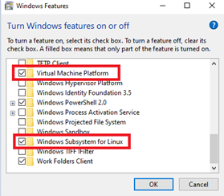
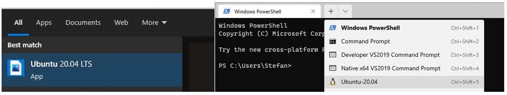
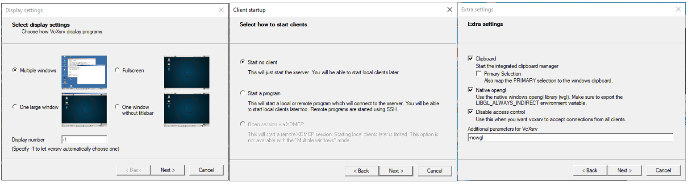

Windows WSL Setup
==========================================

**Motivation**

WSL (Windows Subsystems for Linux) can be used to run ROS packages in a Linux environment while using Windows to run the Traxara simulation stack.

**Requirements:**

- WSL is only supported in Windows educational and professional versions.

Installation
-------------
In the ``Turn Windows features on or off`` configuration page, ensure that ``Virtual Machine Platform`` and ``Windows Subsystem for Linux`` are active.




Using ``Powershell``, install the desired Ubuntu version (see table below). Use ``wsl --list -v`` to view the list of installed distributions.

.. code-block:: shell

    wsl --install -d <version>

===========     =======================
ROS version     WSL Ubuntu version key
===========     =======================
ROS1 Noetic     Ubuntu-20.04
ROS2 Foxy       Ubuntu-20.04
ROS2 Humble     Ubuntu-22.04
ROS2 Jazzy      Ubuntu-24.04
===========     =======================


Afterwards, run Ubuntu from the start menu (left screenshot). The `Microsoft Terminal <https://www.microsoft.com/en-ca/p/windows-terminal/9n0dx20hk701>`_ can also be used to quickly open WSL distribution prompts (right screenshot).



In Ubuntu, run the following commands to install prerequisite packages for running GUI applications:

.. code-block:: shell

    # In Ubuntu environment

    sudo apt update && sudo apt -y upgrade
    sudo apt install build-essential
    sudo apt install net-tools
    sudo apt install xrdp -y && sudo systemctl enable xrdp
    sudo apt install -y tasksel
    sudo tasksel install xubuntu-desktop
    sudo apt install gtk2-engines


Put the following in ``~/.bashrc``:

.. code-block:: shell

    export DISPLAY=$(cat /etc/resolv.conf | grep nameserver | awk '{print $2; exit;}'):0.0
    export LIBGL_ALWAYS_INDIRECT=0
    sudo /etc/init.d/dbus start &> /dev/null


`Install VcXsrv <https://sourceforge.net/projects/vcxsrv/>`_ server in your Windows environment. You will need to run VcXSrv in the Windows environment for Ubuntu to stream graphics data.

Once installed, run ``C:\Program Files\VcXsrv\xlaunch.exe``. Keep all default options except in the **Extra settings** screen where you should enter ``-nowgl`` in the **Additional parameters for VcXsrv** textbox.




With VcXsrv running, test that a GUI application run in the WSL environment can be displayed in Windows. For example, run ``firefox`` to launch the Firefox browser.

Install ROS in WSL
-------------------

Install the desired version of ROS:
    - `ROS1 Noetic (Ubuntu 20.04) <http://wiki.ros.org/noetic/Installation/Ubuntu>`_
    - `ROS2 Foxy (Ubuntu 20.04) <https://docs.ros.org/en/foxy/Installation/Ubuntu-Install-Debians.html>`_
    - `ROS2 Humble (Ubuntu 22.04) <https://docs.ros.org/en/humble/Installation/Ubuntu-Install-Debians.html>`_
    - `ROS2 Jazzy (Ubuntu 24.04) <https://docs.ros.org/en/jazzy/Installation/Ubuntu-Install-Debians.html>`_

If your package is in ROS1, you will also need to run the ``ros_bridge`` utility. The following is an example setup appended to ```~/.bashrc```
where ROS1 and ROS2 can be activated independently for use with ``ros_bridge``. However, if only a single version of ROS is installed,
no callable block is needed and the ``source`` command may be included directly.

.. code-block:: shell

    source_ros2(){
      source /opt/ros/foxy/setup.bash
      source ~/ros2_ws/install/setup.bash
    }

    source_ros1(){
      source /opt/ros/noetic/setup.bash
      source ~/ros1_ws/devel/setup.bash
    }

    run_rosbridge(){
      source_ros1
      source_ros2
      ros2 run ros1_bridge dynamic_bridge
    }


Installing Navigation Stack
----------------------------
Refer to original Build From Source documentation for either `ROS1 <ros1-linux-build.html>`_ or `ROS2 <ros2-linux-build.html>`_
