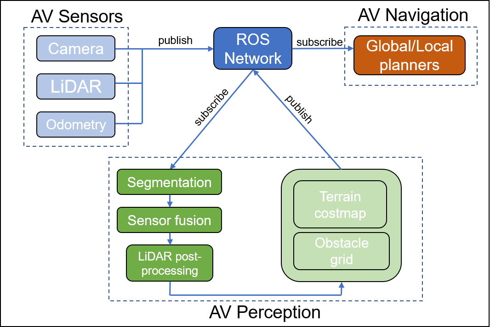

Semantic terrain segmentation
=============================

Overview
--------

Performs semantic segmentation and classification on camera images and fuses with point cloud data 
to create a costmap based on vehicle traversability, along with an optional obstacle grid 
containing the probability of an object being present at a given location.

The `uab_perception_node` is a C++ wrapper for the machine learning model written in MATLAB.

ROS Interface
-------------

Subscriptions
^^^^^^^^^^^^^

.. csv-table:: Subscribed topics
   :file: subscriptions.csv
   :header-rows: 1

Publishers
^^^^^^^^^^

.. csv-table:: Published topics
   :file: publishers.csv
   :header-rows: 1

Parameters
^^^^^^^^^^

.. csv-table:: Parameters
   :file: parameters.csv
   :header-rows: 1

Troubleshooting
---------------

* **Issue**: "Fatal error C1083: Cannot open include file: 'mclmcrrt.h': No such
  file or directory"
* **Solution**: Set the MATLAB include directory manually under the
  `Matlab_MCLMRRT_LIB` line in the CMakeLists file.
  
  .. code-block:: cmake

    set(Matlab_INCLUDE_DIRS "<path-to-MATLAB-Runtime>/v912/extern/include")

Further information
-------------------

The `uab_perception_node` is capable of publishing both terrain segmentation and obstacle grids. Each cell of the terrain segmentation grid contains the cost (0-100)
associated with the vehicle traversing over a particular area of the environment. Lower costs indicates terrain such as roads or dirt paths, while higher costs
indicate grassy areas or even smaller vegetation (ex. tall grass or bushes). The costs are calculated by combining three separate probabilistic grids
each containing the probability of their respective terrain type (low, medium, high) being present at each cell. The obstacle grid is similarly constructed by 
estimating the probability of an obstacle located at a given cell. This grid can be enabled/disabled by using the `publish_uab_occupancy_grid` flag in the 
`uab_perception.yaml` configuration file. While the grid is always built, this will prevent it from being published so the terrain segmentation grid can be used 
alongside other obstacle detection algorithms.

The model is dependent on the sensor transform between camera and LiDAR sensors since the data is fused together for mapping in 3-D space. The default sensor transform
matches what is used on the MRZR vehicle at KRC. This information must be included at compile time, so a new build must be done to work with other sensor configurations.
Contact nicbowen@uab.edu for more information.

For more information on the terrain semantic segmentation node algorithms and
implementation, refer to the following documents:

* :download:`Dataset preparation for DeepLab V3+ Training <dataset_preparation_for_deeplab_v3+_training.pptx>`
* :download:`Machine Learning Overview: Modified Echo State Networks for LiDAR Data Processing <ml_esn_overview.pptx>`

.. raw:: latex

  If you are browsing the documentation in PDF format, you may need to use these
  links instead:

  \begin{itemize}
    \item \href{https://www.dropbox.com/scl/fi/rejwf0q3hba38lkljfme0/dataset\_preparation\_for\_deeplab\_v3-\_training.pptx?rlkey=tr0si3ctbdtjjw80q522wjiv3\&st=o7eswjd8\&dl=0}{Dataset preparation for DeepLab V3+ Training}
    \item \href{https://www.dropbox.com/scl/fi/f0evthrbaxeg6hn5rsjul/ml\_esn\_overview.pptx?rlkey=dun0bxe1yq0sbtmxqoydtxa83\&st=9idqq87i\&dl=0}{Machine Learning Overview: Modified Echo State Networks for LiDAR Data Processing}
  \end{itemize}